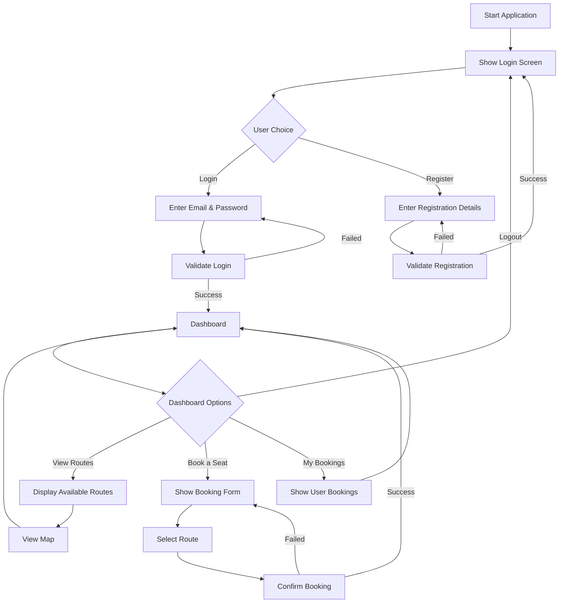

```mermaid
flowchart TD
    A[Start Application] --> B[Show Login Screen]
    B --> C{User Choice}

    C -->|Login| D[Enter Email & Password]
    C -->|Register| E[Enter Registration Details]

    E --> F[Validate Registration]
    F -->|Success| B
    F -->|Failed| E

    D --> G[Validate Login]
    G -->|Failed| D
    G -->|Success| H[Dashboard]

    H --> I{Dashboard Options}

    I -->|View Routes| J[Display Available Routes]
    I -->|Book a Seat| K[Show Booking Form]
    I -->|My Bookings| L[Show User Bookings]
    I -->|Logout| B

    K --> M[Select Route]
    M --> N[Confirm Booking]
    N -->|Success| H
    N -->|Failed| K

    J --> O[View Map]
    O --> H
    L --> H
```
