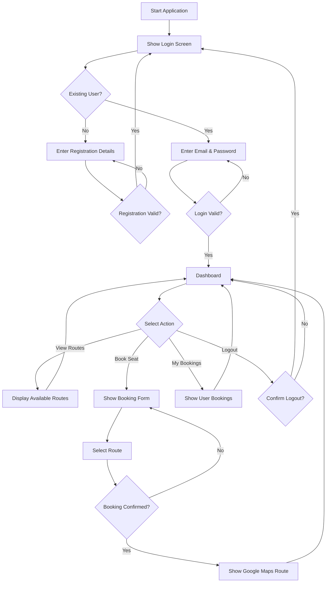

```mermaid
flowchart TD
    A[Start Application] --> B[Show Login Screen]
    B --> C{Existing User?}

    C -->|No| E[Enter Registration Details]
    C -->|Yes| D[Enter Email & Password]

    E --> F{Registration Valid?}
    F -->|Yes| B
    F -->|No| E

    D --> G{Login Valid?}
    G -->|No| D
    G -->|Yes| H[Dashboard]

    H --> I{Select Action}

    I -->|View Routes| J[Display Available Routes]
    J --> H

    I -->|Book Seat| K[Show Booking Form]
    K --> M[Select Route]
    M --> N{Booking Confirmed?}
    N -->|Yes| Q[Show Google Maps Route]
    Q --> H
    N -->|No| K

    I -->|My Bookings| L[Show User Bookings]
    L --> H

    I -->|Logout| R{Confirm Logout?}
    R -->|Yes| B
    R -->|No| H
```
